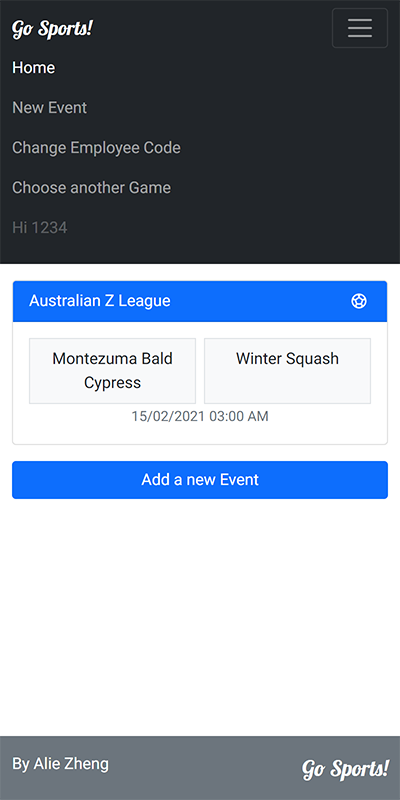
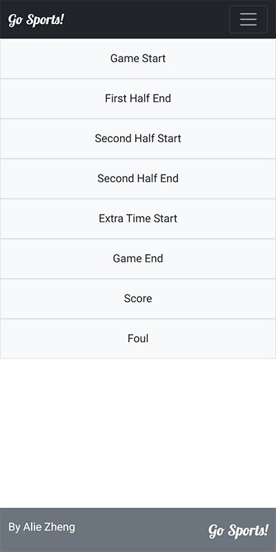
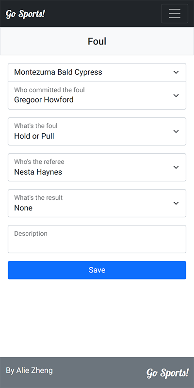

# Go Sport Code Exercise

Simple RESTful API built with ASP.NET Web API and Angular

## Environment

Server: Asp.Net Web API 5.0 + Entity Framework Core + Sqlite + XUnit

Client: Angular 11 + Boostrap 5.0

## Features

1. This app uses custom fields to implement the event system. Different events have multiple custom fields which have different behavior. In this way it ensures the high extensiblity of the different format of events and multiple types of games. Check this commit [How to add a new Field Type](https://github.com/dededemi1113/GoSports/commit/1d43aff5f9e32811f330eff9a4f0ccac33252b92) to see how easily we can add a new field type to meet the future changes.

2. The GameMemoryService at the server side simulates the external API which returns the data for games, teams, and players etc. The sample data is located in `src/Server/Events_API/Templates/Games.json`.

3. The GameTemplates.json in the same directory defines the data structure of different games. Currently it has the definitions for Soccer and Basketball. Each has different events. Each event has different fields. Implemented some basic validation (required) to demonstrate the use of custom fields.

4. The Sqlite database will be generated automatically in the /Data folder at the first time running.

5. This current structure is cloud-ready. We can easily containerize each part of the app. e.g. Create a Redis container to cache the game templates. 

6. The client app is fully responsive. I checked it in the Chrome's mobile mode and it works fine.

7. Considering the usability I simplified most of the input. e.g. Use a simple digit input to eliminate the use of the complex mobile keyword input. 

## Setting up locally

1. Get the code.

```git clone https://github.com/dededemi1113/GoSports.git```

2. Go to the Server directory.

```cd GoSports/src/Server/Events_API```

3. Run the server.

```dotnet run```

4. Open a new terminal and go to the Client directory.

```cd GoSports/src/Client/go-sports```

5. Install the dependencies.

```yarn install```

6. Run the client app.

```yarn start```

7. Open a browser and access http://localhost:4200/ to view the page.

## Unit Test

1. Go to the Server directory.

```cd src/Server```

2. Run the tests.

```dotnet test```

## User Process

1. Assume each employee has a 4-digits Employee code. If there's no employee code was input, the login screen would appear and ask for the Employee code.


2. After input the Employee code, the user need to choose a game from all the current available games. 


3. User then will be redirected to the home screen. In the popup menu at the top-right, user can reinput the Employee code or reselect the game.



4. When adding an event, an event type needs to be selected first.



5. Then input the details of the event.


6. Save and go back to the home screen and the event is there.


7. Click to expand it. And click on the header or footer to collaps it again. 


8. Click the content to edit it.



9. Click the `X` icon to delete it.


10. Complex field and validation demo in the `Game End` event.


